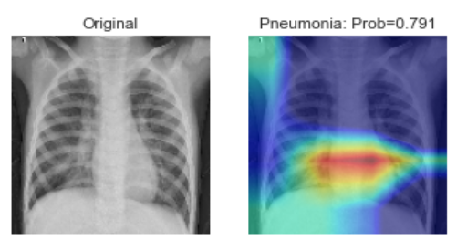

# Deep Learning Project: Pneumonia Detection from Chest X-Ray Images using Transfer Learning

<pre>
Domain             : Computer Vision, Machine Learning
Sub-Domain         : Deep Learning, Image Recognition
Techniques         : Deep Convolutional Neural Network, DenseNet121
Application        : Image Recognition, Image Classification, Medical Imaging
</pre>

### Description
<pre>
A Deep Convolutional Neural Network which is able to detect whether a patient has pneumonia or not, based on their chest x-rays. Implement transfer learning by retraining pretrained model "DenseNet121" with 5856 X-Ray images. 
For retraining GlobalAveragePooling and Dense Layer with sigmoid function are added to the ouput of DenseNet121 to generate probablity of having pneumonia disease.
Before Training DenseNet121, I have build a model using Custom Neural Network with 14 layers which gave an accuracy of 87.18%, precision 83.4% and recall 99.2% on test set. But when I looked at GradCAM I found out that model is not able to look into more granuler areas where it should be.
So I decided to switch to transfer learning to acquire better results, so I started working on DenseNet121 which gave an accuracy of 90.22%, precision 87.64% and recall 98.21% which is pretty good.
I have also used GradCAM to understand  where the model is looking on a particular layer when classifying an image.
</pre>

### Dataset
<pre>
The dataset consists of only X-Ray images which is organised into 3 directories i.e. train, val and test. These directories consists of two subfolders which consists of x-ray images of normal and pneumonia patients i.e. NORMAL and PNEUMONIA.
There are total 5856 X-Ray images in our dataset which are splitted up as shown below.

Total (5856):		 NORMAL - 1583 | PNEUMONIA - 4273
Train (5216):            NORMAL - 1341 | PNEUMONIA - 3875
Val (16)	:        NORMAL - 8 | PNEUMONIA - 8
Test (624)	:        NORMAL - 234 | PNEUMONIA - 390
</pre>

### Dataset Links
<pre>
Name         : Chest X-Ray Images(Pneumonia)
Link         : <a href=https://www.kaggle.com/paultimothymooney/chest-xray-pneumonia>Chest X-Ray Images(Pneumonia) Dataset (Kaggle)</a>
             : <a href=https://data.mendeley.com/datasets/rscbjbr9sj/2>Chest X-Ray Images(Pneumonia) Dataset (Original Dataset)</a>
</pre>

### Tools / Libraries
<pre>
Languages               : Python, Flask, HTML, Css
Tools/IDE               : Anaconda
Libraries               : Keras, TensorFlow, DenseNet121, ImageNet
</pre>

<b>Model Parameters</b>
| Attributes    | Custom Model        |  Pretrained Model |
| ------------- |---------------------|-------------------|
| Base Model    | Custom              | DenseNet121 		  |
| Optimizers    | Adam                |   Adam    			  |
| Loss Function | binary_crossentropy |binary_crossentropy|

<b>Training Parameters</b>
| Attributes    | Custom Model      |DenseNet121 Model|
| ------------- |-------------      | ----- 				  |
| Batch Size    | 8              	  | 8 		   			  |
| # Epochs      | 30             	  |   10    			  |
| Image Size    | 320 * 320        	|   120 * 120    	|

<b>Model Evaluation (Testing Set)</b>
| Attributes    | Custom Model        |DenseNet121 Model  |
| ------------- |---------------------|-------------------|
| Accuracy(%)   | 87.18           	  |   90.22	   			  |
| Precision(%)  | 83.41               |   87.64    			  |
| Recall(%)     | 99.23       	      |   98.21     		  |
| Loss (%)      | 38.86        	      |   45.46     		  |
| AUC  (%)      | 94.07        	      |   93.52     		  |

### Sample Output: 

<kbd>

</kbd>
<b>True Label: Pneumonia | Predicted Label: Pneumonia</b>

<kbd>

</kbd>
<b>True Label: Normal | Predicted Label: Normal</b>

### Confusion Matrix (With Threshold of 50% Probability): 
<kbd>

</kbd>

### Confusion Matrix (With Threshold of 13.5% Probability): 
<kbd>

</kbd>

### Links to Project
<pre>
GitHub       : <a href=https://github.com/KareliaConsolidated/Projects/tree/master/Pnemonia%20Detection>Pneumonia Detection</a>
Live Project : <a href=https://pneumonia-detect-kc.herokuapp.com/>Pneumonia Detection</a> 
Kaggle       : <a href=https://www.kaggle.com/kareliaconsolidated/pretrained-pneumonia-detection-90-ac-98-recall>Pneumonia Detection</a>
</pre>